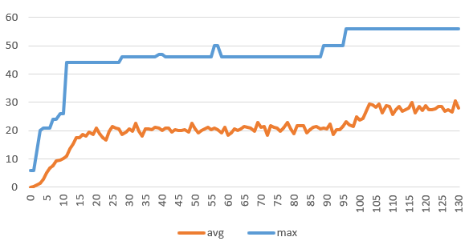
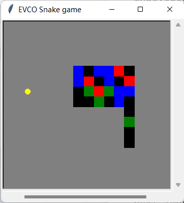

Genetic programming is a special field of evolutionary computation that aims at building programs automatically to solve problems independently of their domain. In our game, the evolved individuals can be used to control  the snake so that it can eat all the food located in a given environment.

**Primitives**

pset.addPrimitive(snk.if_food_ahead, 2)
pset.addPrimitive(snk.if_wall_tail_ahead, 2)
pset.addPrimitive(snk.if_direction_food, 2)
pset.addPrimitive(prog2, 2)
pset.addPrimitive(prog3, 3)

pset.addTerminal(snk.update_snake_position)
pset.addTerminal(snk.turn_left)
pset.addTerminal(snk.turn_right)

- `if_food_ahead` is a primitive which executes its first argument if there is food in front of the snake; else, it executes its second argument.
- `if_wall_tail_ahead`is a primitive which executes its first argument if there is wall of tail in front of the snake; else, it executes its second argument.
- `if_direction_food`is a primitive which executes its first argument if the current direction is towards the food; else, it executes its second argument. Use `Manhattan Distance` to evaluate the distance.
- `prog2()` `prog3()` They execute one of their children in random.
- `update_snake_position` makes the snake move one front. This is a terminal.
- `turn_right()` and `turn_left() `makes the snake turning clockwise and counter-clockwise, without changing its position. Those are also terminals.

**Crossover**

`deap.tools.cxOnePoint`(*ind1*, *ind2*) to crossover, which executes a one point crossover on the input individuals. The two individuals are modified in place. The resulting individuals will respectively have the length of the other.

**Mutation**

`deap.tools.mutUniformInt`

Mutate an individual by replacing attributes, with probability *indpb*, by a integer uniformly drawn between *low* and *up* inclusively.

**Selection**

`deap.tools.selTournament`

Select the best individual among *tournsize* randomly chosen individuals, *k* times. The list returned contains references to the input *individuals*.

**Avoid circling**

set the step_num in Class snake, if step_num bigger than `self.XSIZE * self.YSIZE * 20` without a score change, let game over.

**Training data**

gen	nevals	avg     	std     	min	max
0  	300   	0.106667	0.543405	0  	6  
1  	193   	0.296667	0.780164	0  	6  
2  	204   	0.71    	1.40922 	0  	13 
3  	214   	1.46667 	2.3041  	0  	20 
4  	201   	2.86667 	3.91691 	0  	21 
5  	195   	5.07    	5.34276 	0  	21 
6  	196   	6.67    	6.59705 	0  	21 
7  	204   	7.72    	7.52119 	0  	24 
8  	192   	9.18    	8.36865 	0  	24 
9  	204   	9.71333 	8.66282 	0  	26 
10 	209   	10.07   	9.07001 	0  	26 
11 	212   	11.1233 	9.86922 	0  	44 
12 	198   	13.6333 	10.3617 	0  	44 
13 	209   	15.37   	11.3739 	0  	44 
14 	191   	17.3833 	12.4904 	0  	44 
15 	197   	17.5267 	13.8025 	0  	44 
16 	183   	18.59   	15.2522 	0  	44 
17 	205   	18.0033 	15.5352 	0  	44 
18 	187   	19.5667 	16.4193 	0  	44 
19 	200   	18.64   	17.0821 	0  	44 
20 	195   	20.7867 	17.7877 	0  	44 
21 	209   	18.8    	17.812  	0  	44 
22 	216   	17.5533 	17.2322 	0  	44 
23 	210   	16.6967 	17.1407 	0  	44 
24 	188   	19.6933 	18.3126 	0  	44 
25 	179   	21.54   	18.8675 	0  	44 
26 	195   	20.92   	17.954  	0  	44 
27 	190   	20.6467 	18.283  	0  	44 
28 	206   	18.72   	17.9065 	0  	46 
29 	200   	19.4167 	17.7579 	0  	46 
30 	192   	20.5367 	18.1726 	0  	46 
31 	198   	19.7167 	18.3157 	0  	46 
32 	177   	22.5367 	18.2741 	0  	46 
33 	195   	19.7133 	18.4267 	0  	46 
34 	210   	17.9967 	18.5746 	0  	46 
35 	190   	20.6433 	18.9542 	0  	46 
36 	197   	20.7    	18.841  	0  	46 
37 	200   	20.45   	18.699  	0  	46 
38 	189   	21.1033 	19.5016 	0  	46 
39 	202   	20.8467 	18.8477 	0  	47 
40 	205   	19.98   	18.5901 	0  	47 
41 	187   	20.9467 	19.3545 	0  	46 
42 	195   	20.8733 	19.1951 	0  	46 
43 	207   	19.4767 	18.8435 	0  	46 
44 	190   	20.3367 	19.5977 	0  	46 
45 	202   	20.1367 	18.9023 	0  	46 
46 	198   	20.13   	19.2913 	0  	46 
47 	196   	20.25   	19.0937 	0  	46 
48 	204   	19.4233 	18.4045 	0  	46 
49 	187   	22.5    	18.6484 	0  	46 
50 	198   	20.7    	18.8748 	0  	46 
51 	199   	19.34   	19.1779 	0  	46 
52 	196   	20.0833 	19.3264 	0  	46 
53 	197   	20.55   	19.0811 	0  	46 
54 	189   	21.1933 	18.9583 	0  	46 
55 	205   	20.2633 	18.6789 	0  	46 
56 	190   	20.8167 	19.1169 	0  	50 
57 	193   	20.39   	19.3402 	0  	50 
58 	206   	19.32   	18.8644 	0  	46 
59 	191   	21.23   	18.6797 	0  	46 
60 	213   	18.45   	18.1984 	0  	46 
61 	201   	19.2467 	18.8974 	0  	46 
62 	197   	20.7333 	18.98   	0  	46 
63 	206   	19.9767 	18.5507 	0  	46 
64 	196   	20.6333 	18.8948 	0  	46 
65 	187   	21.56   	19.1221 	0  	46 
66 	197   	21.1967 	18.945  	0  	46 
67 	192   	21.03   	19.5827 	0  	46 
68 	206   	19.8933 	18.7919 	0  	46 
69 	181   	22.8333 	19.1476 	0  	46 
70 	200   	21.18   	18.8962 	0  	46 
71 	191   	21.4667 	19.1441 	0  	46 
72 	213   	18.28   	18.4543 	0  	46 
73 	191   	21.6833 	19.0609 	0  	46 
74 	196   	21.3033 	19.0807 	0  	46 
75 	188   	20.9933 	19.5173 	0  	46 
76 	202   	19.8267 	18.9178 	0  	46 
77 	195   	21.0167 	19.191  	0  	46 
78 	186   	22.8233 	19.3175 	0  	46 
79 	196   	20.66   	19.2696 	0  	46 
80 	208   	18.84   	18.604  	0  	46 
81 	186   	21.6867 	19.1132 	0  	46 
82 	184   	21.8933 	19.3272 	0  	46 
83 	188   	21.6667 	19.2243 	0  	46 
84 	209   	19.09   	18.9597 	0  	46 
85 	197   	20.3    	18.9658 	0  	46 
86 	186   	21.15   	19.3985 	0  	46 
87 	188   	21.53   	19.6668 	0  	46 
88 	197   	20.58   	19.1375 	0  	46 
89 	198   	20.9467 	18.79   	0  	50 
90 	193   	20.52   	19.166  	0  	50 
91 	189   	22.3767 	18.9042 	0  	50 
92 	218   	18.53   	18.4066 	0  	50 
93 	190   	20.38   	19.722  	0  	50 
94 	204   	20.39   	19.19   	0  	50 
95 	202   	21.3533 	19.7341 	0  	50 
96 	191   	23.0767 	20.6734 	0  	56 
97 	206   	22.0867 	20.2206 	0  	56 
98 	211   	21.3633 	19.6818 	0  	56 
99 	184   	24.77   	20.5718 	0  	56 
100	198   	23.7333 	21.6531 	0  	56 
101	205   	24.4433 	20.9728 	0  	56 
102	191   	26.9767 	21.7898 	0  	56 
103	177   	29.41   	22.6582 	0  	56 
104	184   	29.0733 	22.5553 	0  	56 
105	192   	28.16   	22.2813 	0  	56 
106	186   	29.3133 	21.9548 	0  	56 
107	203   	26.42   	21.0438 	0  	56 
108	181   	28.96   	22.4947 	0  	56 
109	192   	28.5333 	21.7176 	0  	56 
110	204   	25.8033 	21.7638 	0  	56 
111	194   	27.3167 	21.2557 	0  	56 
112	189   	28.4933 	21.781  	0  	56 
113	198   	26.7533 	21.5634 	0  	56 
114	193   	27.4467 	21.6157 	0  	56 
115	187   	27.9667 	21.5702 	0  	56 
116	183   	30.0567 	21.9019 	0  	56 
117	199   	26.4033 	22.2961 	0  	56 
118	186   	28.4333 	22.1094 	0  	56 
119	200   	27.1467 	21.5889 	0  	56 
120	194   	28.8333 	21.1496 	0  	56 
121	197   	27.31   	21.654  	0  	56 
122	197   	27.33   	21.6809 	0  	56 
123	190   	27.6    	22.1581 	0  	56 
124	190   	28.6    	21.8716 	0  	56 
125	187   	28.47   	21.8656 	0  	56 
126	200   	26.9433 	21.8368 	0  	56 
127	188   	27.5033 	22.3733 	0  	56 
128	207   	26.4567 	21.3206 	0  	56 
129	173   	30.6533 	22.0094 	0  	56 
130	192   	28.0367 	21.7207 	0  	56 

**How to improve**

It can be seen that the snake has penetrated into its own body and the next improvement is to add new senses so that snakes can avoid it.

The method of avoiding snake circular motion is too simple, and it would be better if the snake could make its own judgment of being trapped in the loop through perception.

