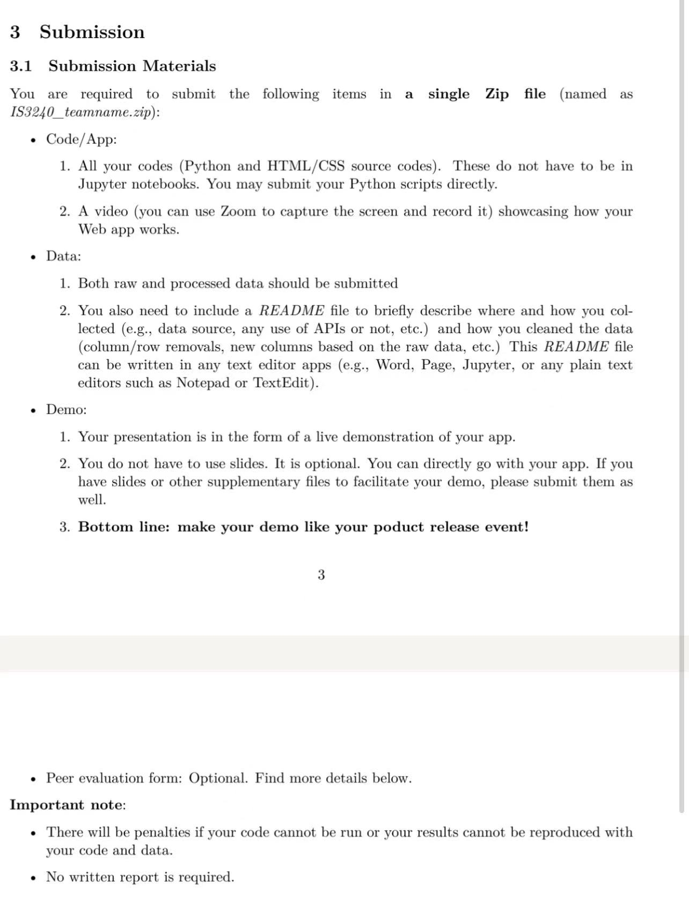

软件：Web App (Python + HTML) 
1.帐号管理
-可以註冊一個新帳戶。 後端伺服器應該儲存用戶資訊 (名稱/密碼)
-使用使用者名稱和密碼登入。
–更新密碼
–注销帳戶

2.可以查询最新TikTok 流行趨勢
-可以使用以下API: https://rapidapi.com/Sonjik/api/tokapi-mobile-version/discussions

What is TokApi – mobile version?
TokApi – mobile version is a TikTok mobile API that allows developers to search with ease.
Endpoints:
Trending – view all trending categories and feed recommendations
Hashtag ID – search posts and videos by Hashtag IDs
-不用实时更新
-相对简单的
-可以在不同类别查看最近趋势
-可以展示一些数据图表分析报告 
-可以导出数据报告

3.简单大方的UI
-全英文
-黑和白色

4.需要所有codes 和raw &processed data, 包括README file to briefly describe where and how you collected (e.g., data source, any use of APIs or not, etc.) and how you cleaned the data
(column/row removals, new columns based on the raw data, etc.) This README file can be written in any text editor apps (e.g., Word, Page, Jupyter, or any plain text
editors such as Notepad or TextEdit)

这个数据从第二个链接那获取就可以

