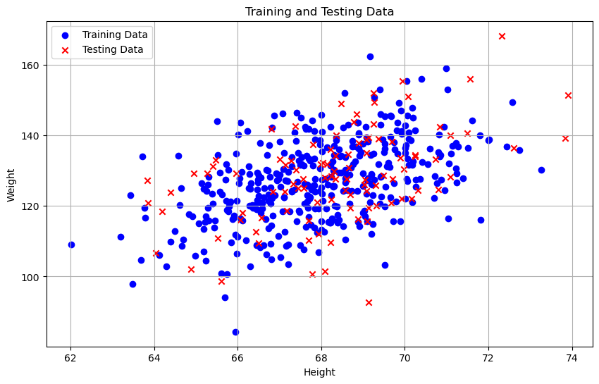
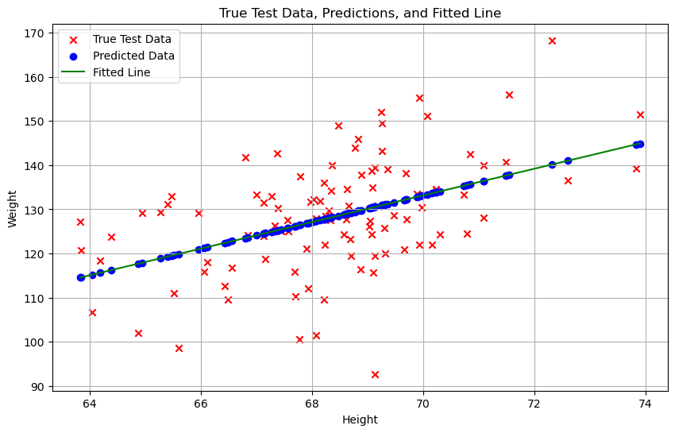
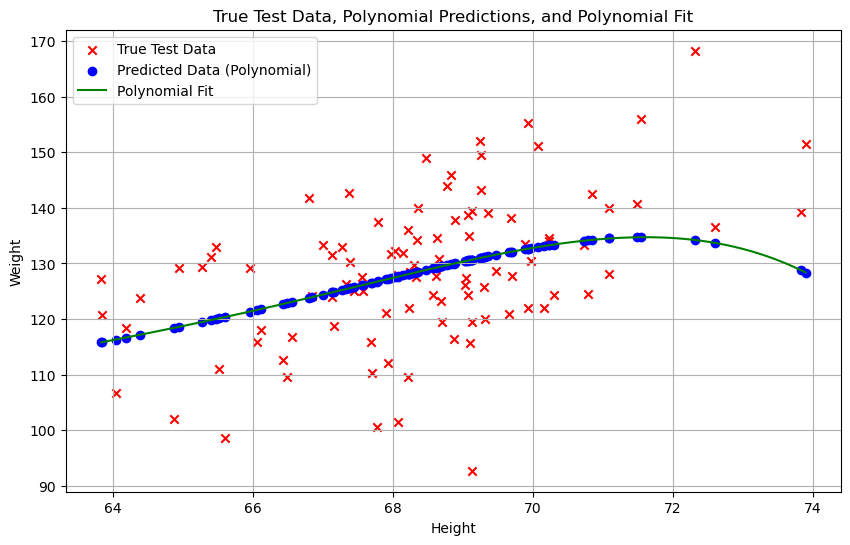

# Homework 2 - Least Sqaures
Make sure you have downloaded:
- HeightAndWeight500.csv

In this assignment we will use data about the height and weight of 500 people


```python
######## DO NOT CHANGE THIS CODE ##########
import matplotlib.pyplot as plt
import numpy as np
import pandas as pd

# Load data
df = pd.read_csv("HeightAndWeight500.csv")
display(df)
###########################################
```


<table border="1" class="dataframe">
  <thead>
    <tr style="text-align: right;">
      <th></th>
      <th>Height</th>
      <th>Weight</th>
    </tr>
  </thead>
  <tbody>
    <tr>
      <th>0</th>
      <td>71.51521</td>
      <td>136.4873</td>
    </tr>
    <tr>
      <th>1</th>
      <td>69.39874</td>
      <td>153.0269</td>
    </tr>
    <tr>
      <th>2</th>
      <td>68.21660</td>
      <td>142.3354</td>
    </tr>
    <tr>
      <th>3</th>
      <td>67.78781</td>
      <td>144.2971</td>
    </tr>
    <tr>
      <th>4</th>
      <td>68.69784</td>
      <td>123.3024</td>
    </tr>
    <tr>
      <th>...</th>
      <td>...</td>
      <td>...</td>
    </tr>
    <tr>
      <th>495</th>
      <td>69.09424</td>
      <td>127.1436</td>
    </tr>
    <tr>
      <th>496</th>
      <td>66.81425</td>
      <td>122.3353</td>
    </tr>
    <tr>
      <th>497</th>
      <td>67.13183</td>
      <td>112.6659</td>
    </tr>
    <tr>
      <th>498</th>
      <td>64.57428</td>
      <td>134.2647</td>
    </tr>
    <tr>
      <th>499</th>
      <td>68.68038</td>
      <td>120.6936</td>
    </tr>
  </tbody>
</table>
<p>500 rows × 2 columns</p>
</div>


# 1 Create training and test data
## 1.1 Get X and y
1. [1 pt] Define the following numpy arrays by choosing the correct columns of the dataframe:
    - `X`, which contains the 'Height' column
    - `y`, which contains the 'Weight' column
    - For your reference, the units of the 'Height' and 'Weight' columns are inches and pounds respectively
2. [1 pt] Print the shapes of `X` and `y`.


## 1.2 Train-test split
1. [1 pt] Create new numpy column arrays called `X_train`, `X_test`, `y_train`, and `y_test`, where:
    - you use train_test_split() function from sklearn.model_selection
    - the training dataset contains the 80% of samples
    - the testing dataset contains the 20% of samples
    - ***random state set to 45.***

2. [2 pt] Print the shape of the training and testing datasets. Make sure the prints are informative.


## 1.3 Scatter plot
1. [1 pt] On the same figure, make scatterplots of the training and testing data.
    - x-coordinate should be height, X, and 
    - y-coordinate should be weight, Y.
2. [1 pt] Use markers with different shapes and colors to show to training and testing datasets. 
3. [1 pt] Include 
    - x axis labels, 
    - y axis labels, 
    - grid lines,
    - an approapriate title, and 
    - a legend.



    


# 2 (Manual) Least Squares Linear Regression
## 2.1 Obtain coefficients
[2 pt] Without using sklearn or other packages, implement least squares linear regression to fit a line to the __training__ data using the linear model, 
    $$Y=a^T X + b,$$
    where $a$ is a vector of weight coefficients for each feature and $b$ is a scalar offset. **(You should follow the implementation seen in lecture.)**

Compute the fitted values for $a$ and $b$ and print them. 
- Make sure you specify in your prints, which is $a$ and which is $b$.

### Note:
This is different from the elementary implementation from section. **Your method should involve matrix multiplications**


## 2.2 Predict
[1 pt] Use your custom fitted model to make a prediction about the `Y_test` values given `X_test` values. Name the predicted values of `Y_test_pred_linear`. **Your method should involve matrix multiplications.**


# 3 (sklearn) Least Squares Linear Regression
## 3.1 Obtain coefficients
[2 pt] Use sklearn.linear_model.LinearRegression to fit a linear model to the training data. See their documentation for how to use the model.
- You may need to reshape the data to column arrays by array.reshape(-1,1).

Extract the fitted values for $a$ and $b$ and print them. Make sure you specify in your prints, which is $a$ and which is $b$.
- At this point, you should verify that the $a$ and $b$ values you obtained manually and by sklearn are basically the same.


## 3.2 Predict
[1 pt] Use your sklearn fitted model to make a prediction about the `Y_test` values given `X_test` values. Name the predicted values of `Y_test_pred_sklearn`. **Your method should involve matrix multiplications.**


## 3.3 Verify correctness
[1 pt] Write code, with any relevant prints, to verify that `Y_test_pred_linear` and `Y_test_pred_sklearn` are the same.    
- You can use the np.allclose() function. You may need to flatten the sklearn prediction array `Y_test_pred_sklearn`.


## 3.4 Plot
[3 pt] On the same figure (x-coordinate is height. y-coordinate is weight), make the following plots:
1. Scatter plot of true test data.
2. Scatter plot of prediction on test points, based on linear model.
3. Straight line plot of linear model, which you should base of the fitted coefficients. 

[1 pt] Use point markers with different shapes and colors to show to testing data and prediction. Your figure must include 
- x axis labels, 
- y axis labels, 
- gridlines, 
- an approapriate title, and 
- a legend.


​    

​    


## 3.5 Discuss
[1 pt] Is the method of least squares linear regression appropriate for the height and weight data? Why or why not? In particular, we seek your reflection on whether the data is suitable for linear modelling.

Yes, linear regression is a simple and effective model for modeling the relationship between height and weight.

# 4 (Manual) Least Squares on 5th order polynomial
## 4.1 Obtain Coefficients
Now, suppose we instead used the 5th order polynomial model
$$
Y = a_5 x^5 + a_4x^4 + \dots + a_1 x + a_0.
$$
[2 pt] Compute and print the fitted coefficients $a_0, \dots, a_5$. You must do this using the custom/manual method, not via sklearn package. 
- Print them to 12 decimal places.


## 4.2 Predict
[1 pt] Use your fitted coeffcients to make a prediction about the `Y_test` values given `X_test` values. Name the predicted values of `Y_test_pred_poly`. **Your method should involve matrix multiplications.**


## 4.3 Plot
[3 pt] On the same figure (x-coordinate is height. y-coordinate is weight), make the following plots:
1. Scatter plot of true test data.
2. Scatter plot of prediction on test points, based on polynomial model.
3. Curved line plot of polynomial model, which are based off the fitted coefficients. 

[1 pt] Use point markers with different shapes and colors to show to testing data and prediction. Your figure must include 
- x axis labels, 
- y axis labels, 
- gridlines, 
- an approapriate title, and 
- a legend.


​    

​    


## 4.4 Compare linear (1st order) and polynomial (5th order)

1. [1 pt] Compute the mean squared error (MSE) on the test points of both:
- 1st order model, `mse_linear`
- 5th order model, `mse_poly`

(The residual is "the actual values of `Y`" minus "predicted values from the linear model." MSE is the average of (residual squared); this is just a (nonnegative) scalar value that gives one way to measure performance of the models.)

2. [1 pt] Print `mse_linear` and `mse_poly`.


3. [1 pt] Which MSE is smaller? Does it necessarily mean that the model with smaller RSS is always "better"? Why or why not?
The Linear Model has a smaller MSE.
Does not, there might contain overfitting.

