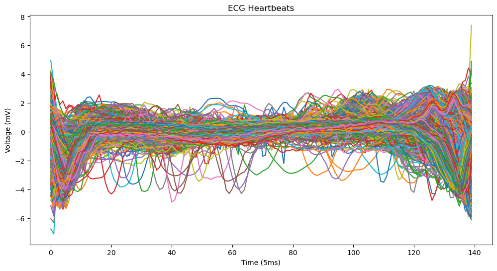
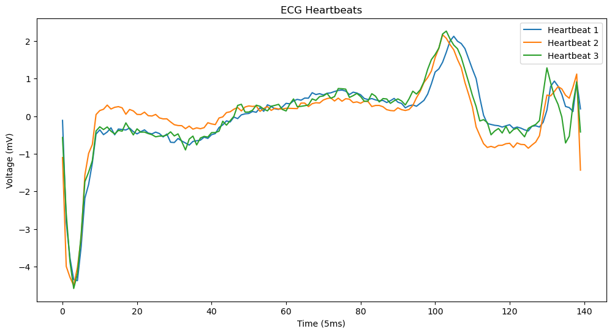
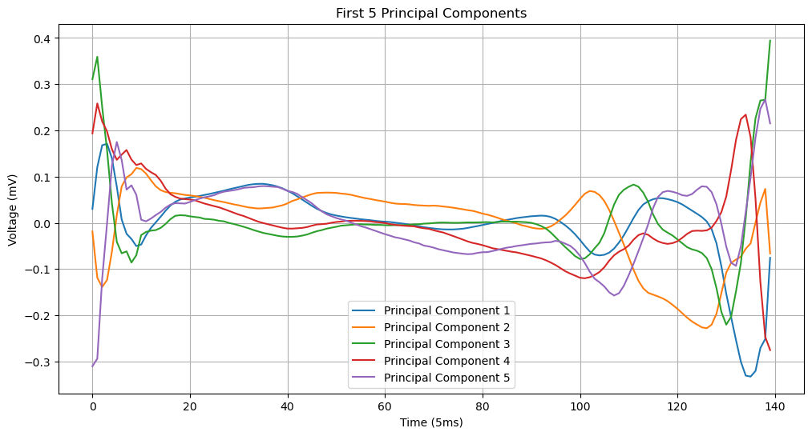
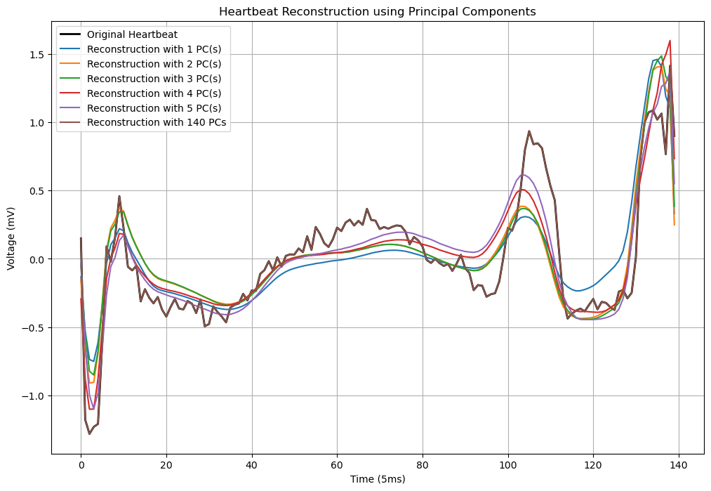

# Homework 3 - Principal Component Analysis on ECG Data
You should have downloaded:
- ECG5000.csv

The homework performs PCA, but in a setting that will feel less familiar from simpler examples seen in lecture or section. But the underlying mathematics in identical and you will get a chance to see a more "real-life" application of PCA.

# 0 Introduction

The original dataset for 'ECG5000' is a 20-hour long ECG downloaded from Physionet. The name is BIDMC Congestive Heart Failure Database(chfdb) and it is record 'chf07'. It was originally published in 'Goldberger AL, et al.: Components of a New Research Resource for Complex Physiologic Signals. Circulation 101(23)'. 

The data set is a 20-h long ECG recorded from a 48-year-old male with severe congestive heart failure. This record has 17,998,834 data points containing 92,584 heartbeats

The data was pre-processed in two steps: (1) extract each heartbeat, (2) make each heartbeat equal length using interpolation. 

**After that, 5,000 heartbeats were randomly selected. The sampling was done at 200 Hz, the patients heart rate was on average 85 BPM.** 
- Note that there are actually 4998 samples in the .csv

This means that there are:
- 4998 heartbeats
- Each heartbeat contains 140 recordings sampled at 200 $Hz$ (200 samples per second) so the total length of the beat is .7 seconds
- There are **140 features per heartbeat**


# 1 Load and visualize data 
**Task**
1. [1 pt] Load two dimensional array `X` in which: 
    - Rows are the 140 recordings 
    - Columns are the observed heartbeats 
    - Print the number of features and samples: "Number of features ____, Number of samples ____"

2. [2 pt] Display all 4998 heartbeats in one figure.
    - The horizontal axis would be the 140 samples (time), each taken every 5 $ms$
    - The vertical axis would be the voltage, in $mV$
    - Include axis labels and a title

3. [1 pt] For your own visualization create another plot that includes only the first 3 heartbeats.
    - Should use the same title and axis labels as (2)



    



    


# 2 PCA

## 2.1 Eigendecomposition by sklearn
**Task:** 
1. [1 pt] Center data by subtracting the mean, store it as ```X_ctd```. 
2. [4 pt] Use the sklearn PCA package to:
    - fit data
    - find covariance matrix, store it as ```cov_mat```
    - find eigenvalues/singular values, store it as ```evals``` (Rmk: singular_values_ is not singular values, Go figure. -.-)
    - find principal components, store it as ```evecs```. Your columns should be the eigenvectors. (Rmk: package gives tranposed version, i.e., rows are the principal components, not columns.)

Through this exercise, we should gain familiarity with the package and understand that you MUST read documentation before using packages.

# 2.2 Scree plot
1. [1 pt] What is a "scree"? What does it mean? This is not a math question. Google it and spend 10 minutes of fun on the web.
    In the context of PCA, a "scree plot" visually represents the eigenvalues in descending order. The plot helps identify the number of components to retain by showing how much variance each component explains. It often looks like a slope, where the point where the slope levels off suggests the optimal number of components to keep.
2. [2 pt] Make a scree plot of the eigenvalues of the covariance matrix.
    - Include title and axis labels
      ​    


# 3 Eigenbasis
## 3.1 Visualization of principal components
**Task:**
1. [2 pt] Generate a 2D plot to display the first 5 principal components.
- Each PC is basically a heartbeat signal, like those plotted earlier. This is how we will visualize a 140-dimensional vector in a two dimensional plot.
- Include a title, legend, and axis labels.



​    


2. [1 pt] Write code to verify that the first 4 principal components are indeed orthogonal.


## 3.2 Signal reconstruction without sklearn
Because the principal components form an basis, each heartbeat can be reconstructed using some weighted sum of the principal components. In this subsection, do not use sklearn package.

**How to reconstruct?** For example, if we are reconstructing the heartbeat with the first $k$ PC, you will project the heartbeat to these principal components with 
$$U_{1:k} U_{1:k}^TX$$
where $U_{1:k}$ is the matrix with first $k$ PCs on each column and $X$ is the heartbeat (column vector).

**Task:**

In the same figure,
1. [1 pt] Plot the first heartbeat, ```heartbeat01```, by indexing the correct row/column of `X_ctd`. 
    - Use solid line to differentiate it more easily from the next plots below.
2. [2 pt] Reconstruct an approximation to ```heartbeat01``` using the first prinicpal component only. 
    - Remember, we are using only one component, so the reconstruction will not be precise, it is only approximate. Use dashed lines to differentiate it from the true ```heartbeat01```.
3. [1 pt] Then repeat the reconstruction of ```heartbeat01``` using the first two, first three, first four, first five, and finally all principal components. Might help to use a for-loop.

4. [1 pt] Your plots should include title, legend, axis labels.

At the end, you should have 6 plots in the same figure:
1. original heartbeat
2. Approximate reconstruction with 1 PC
3. Approximate reconstruction with 2 PC
4. Approximate reconstruction with 3 PC
5. Approximate reconstruction with 4 PC
6. Approximate reconstruction with 5 PC
7. Approximate reconstruction with 140 PC


​    

​    


## 3.3 Data projection with sklearn

**Task:**
1. [1 pt] Project the centered data ```X_ctd``` onto the principal components using an appropriate method in the sklearn PCA pacakage, store it is ```X_proj```.
    - X_proj should have dimensions 140 by 4998. You may need to take transposes accordingly.
2. [1 pt] What is the interpretation of `X_proj[0,:]`? What does each entry represent? Similarly, what is the interpretation of `X_proj[i,:]` for arbitrary row i?

    **Ans:** `X_proj[:,j]` is the jth data/sample projected to the principal components, i.e., after a change of basis to the PCs. Thus, `X_proj[0,j]` is the first entry of that vector, which is the value of the first coordinate w.r.t the PC basis. So, `X_proj[0,:]` is the vector of "value of the first coordinate of each data/sample" w.r.t to the PC basis.

    Similarly, `X_proj[i,:]` is the vector of "value of the ith coordinate of each data/sample" w.r.t to the PC basis.


# 4 Dimensionality reduction
## 4.1 Histogram
[2 pt] On separate figures:
- plot a histogram of `X_proj[0,:]`
- plot a histogram of `X_proj[1,:]`

Set:
- 50 bins equispaced between [-15,15]

So, each histogram uses 4998 datapoints.


    


## 4.2 Visualize data with PC1 and PC2
**Task:**
1. [2 pt] Create scatter plot of the data projected onto the first two principal components.
    - y axis: PC2
    - x axis: PC1
    - Include title, axis labels


​    


2. [1 pt] What does the scatter plot suggest about the number of potential neuronal clusters?

    I observe two distinct groupings in the scatter plot, which may indicate the presence of two primary neuronal clusters. 
