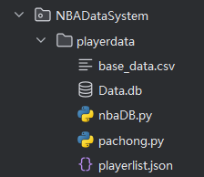
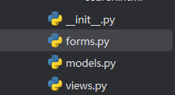

## 启动项目

## playerdata

pachong.py 爬虫代码 数据保存在 base_data.csv

nbaDB.py 建库代码 将 base_data.csv 数据存入数据库, 用kmeans给球员打标签同时存入数据库

Data.db 数据库文件, 可以通过查看

## static

存放各类css js静态文件

## templates

存放模板html文件

## py

forms 表单 用的flask_wtf

models 数据库模型 用的 SQLAlchemy 连接 sqlite

views 视图 

## 功能截图

注册

登录

主页

搜索球员

比较球员

球员数据

球员推荐

