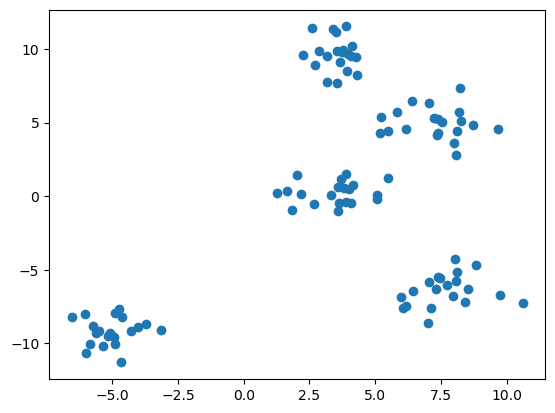
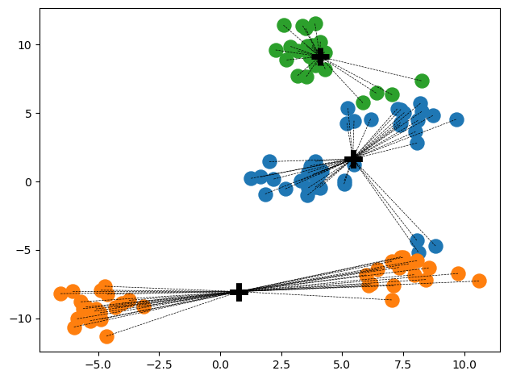

# MTM5004 Assignment 4 - Clustering (10 Marks)

Hello everyone, this assignment notebook covers Clustering. There are some code-completion tasks and question-answering tasks in this answer sheet. For code completion tasks, please write down your answer (i.e., your lines of code) between sentences that "Your code starts here" and "Your code ends here". The space between these two lines does not reflect the required or expected lines of code. For answers in plain text, you can refer to [this Markdown guide](https://medium.com/analytics-vidhya/the-ultimate-markdown-guide-for-jupyter-notebook-d5e5abf728fd) to customize the layout (although it shouldn't be needed).

When you work on this notebook, you can insert additional code cells (e.g., for testing) or markdown cells (e.g., to keep track of your thoughts). However, before the submission, please remove all those additional cells again. Thanks!

**Important:**
* Rename and save this Jupyter notebook as **mtm5004_a4_YourName_YourNUSNETID.ipynb** (e.g., **mtm5004_a4_BobSmith_e12345678.ipynb**) before submission!
* Submission deadline is **Thursday, Jan 18, 11.59 pm**. Late submissions will be penalized by 10% for each additional day. Failure to appropriately rename both files will yield a penalty of 1 Point. There is no need to use your full name if it's rather long; it's just  important to easily identify you in Canvas etc.

Please also add your NUSNET and student id in the code cell below. This is just to make any identification of your notebook doubly sure.


```python
student_id = ''
nusnet_id = ''
```

Here is an overview over the tasks to be solved and the points associated with each task. The notebook can appear very long and verbose, but note that a lot of parts provide additional explanations, documentation, or some discussion. The code and markdown cells you are supposed to complete are well, but you can use the overview below to double-check that you covered everything.


* **1 K-Means (7 Points)**
    * 1.1 Performing K-Means "By Hand" (1 Point)
    * 1.2 Implementing K-Means++ (4 Points)
        * 1.2 a) Initializing Centroids (2 Points)
        * 1.2 b) Assigning Data Points to Clusters (1 Point)
        * 1.2 c) Updating the Centroids (1 Point)
    * 1.2 Questions about K-Means (2 Points)
* **2 Hierarchical Clustering with AGNES (3 Points)**
    * 2.1 Interpreting Dendrograms (2 Points)
    * 2.2 Comparing Linkage Methods (1 Point)

## Setting up the Notebook

### Importing Required Packages


```python
import numpy as np
import pandas as pd
import matplotlib.pyplot as plt
from sklearn.metrics.pairwise import euclidean_distances
from src.utils import plot_kmeans_clustering
```

---

## 1 K-Means (7 Points)

K-Means is a widely used clustering algorithm in machine learning that partitions a dataset into K distinct, non-overlapping clusters. Its objective is to group similar data points together while keeping them as distinct as possible from other groups. The algorithm iteratively assigns data points to clusters and repositions cluster centers until convergence, minimizing the sum of squared distances between data points and their respective cluster centers.

The process begins by randomly initializing K cluster centroids in the feature space. Data points are then assigned to the nearest centroid based on a distance metric, often using Euclidean distance. After the initial assignment, the centroids are recalculated as the mean of all data points within each cluster. This process of assignment and centroid update continues until the centroids no longer significantly change or a predetermined number of iterations is reached. K-Means is efficient and scalable, making it suitable for large datasets, but its performance can be influenced by the initial choice of centroids and the determination of the optimal number of clusters (K), which can be a subjective challenge.


### 1.1 Performing K-Means "By Hand" (1 Point)

The plot below shows a toy dataset of 15 data points labeled A, B, C, ..., O.


Perform K-Means with K=3 on the data shown above, taking points C, H, and M as the initial cluster centers! At the end of each iteration, list the positions of the cluster centers, as well as the set of pointshas belonging to each cluster. At the end, briefly discuss if the final clustering is satisfactory or not. There is no need for you to implement anything here.

**Your Answer:**
The final positions of the cluster centers are:
C(0, 1)
H(0, 0)
M(0, -1)
The set of points belonging to each cluster are:
C: A, B, D, E
H: F, G, I, J
M: K, L, N, O
The final clustering has been satisfactory in the sense that the cluster centers have remained at their initial positions, indicating that the given points can be well-represented by these centers.


### 1.2 Simple Implementation of K-Means (4 Points)

In this task, you implement your on K-Means clustering algorithm. But not to worry, this will be easier than you might think and we will guide you step by step through this process. Since we focus on the basic understanding and not on any optimization strategies, very few basic steps are needed to implement this basic but also very popular clustering algorithm.

First, let's load the toy dataset we will use throughout the task so you can check your implementation after each step.


```python
X = pd.read_csv('data/a4-kmeans-toy-data.csv').to_numpy()

plt.figure()
plt.scatter(X[:,0], X[:,1])
plt.show()
```


    

    


The code cell below contains the class `MyKMeans` you will complete in the following three subtasks. The input parameters for `MyKMeans` should be self-explanatory and are mimic the parameter names from [`sklearn.cluster.KMeans`](https://scikit-learn.org/stable/modules/generated/sklearn.cluster.KMeans.html), so you can check out the documentation if anything is not clear.


```python
class MyKMeans:
    
    def __init__(self, n_clusters=8, max_iter=300):
        self.n_clusters = n_clusters   # Number of cluster to be returned
        self.max_iter = max_iter       # Maximum number of iterations
        self.cluster_centers_ = None   # List of cluster centroids
        self.labels_ = None            # List of cluster labels for each data point
        self.n_iter_ = 0               # Number of iterations performed (<= max_iter)
        
        
    def initialize_centroids(self, X):
        ############################################
        ## To be completed for Task 1.2 a)
        ############################################
    
        # Pick the first centroid randomly
        c1 = np.random.choice(X.shape[0], 1)

        # Add first centroids to the list of cluster centers
        self.cluster_centers_ = X[c1]

        # Calculate and add c2, c3, ..., ck (we assume that we always have more unique data points than k!)
        while len(self.cluster_centers_) < self.n_clusters:

            # c is a data point representing the next centroid
            c = None

            #########################################################################################
            ### Your code starts here ###############################################################

            # Calculcate Euclidean Distances between data points and all centroids
            distances = np.array([np.linalg.norm(X - c, axis=1) for c in self.cluster_centers_])
            
            # Find distances between the data points to their NEAREST centroid
            distances = np.min(distances, axis=0)
                
            # Pick a random data point as next centroid according to the K-Means++ initialization
            probabilities = distances / distances.sum()
            c = X[np.random.choice(X.shape[0], 1, p=probabilities)]
    
            ### Your code ends here #################################################################
            #########################################################################################                

            # Add next centroid c to the array of already existing centroids
            self.cluster_centers_ = np.concatenate((self.cluster_centers_, c), axis=0)

    
    
    def assign_clusters(self, X):
        ############################################
        ## To be completed for Task 1.2 b)
        ############################################
        
        
        # Reset all clusters (i.e., the cluster labels)
        self.labels_ = None

        #########################################################################################
        ### Your code starts here ###############################################################    
            
        # Calculcate Euclidean Distances between data points and all centroids
        distances = np.linalg.norm(X[:, np.newaxis] - self.cluster_centers_, axis=2)

        # For each data point, identify it cluster id (which is of tange 0, 1, ..., k-1)
        self.labels_ = np.argmin(distances, axis=1)
            
        ### Your code ends here #################################################################
        #########################################################################################

    

    def update_centroids(self, X):
        ############################################
        ## To be completed for Task 1.2 c)
        ############################################        

        # Initialize list of new centroids with all zeros
        new_cluster_centers_ = np.zeros_like(self.cluster_centers_)

        for cluster_id in range(self.n_clusters):

            new_centroid = None

            #########################################################################################
            ### Your code starts here ###############################################################  

            # Identify all data points currently assigne to the cluster
            mask = self.labels_ == cluster_id

            # Get the mean of all samples in the cluster
            new_centroid = np.mean(X[mask], axis=0)
            

            ### Your code ends here #################################################################
            #########################################################################################

            new_cluster_centers_[cluster_id] = new_centroid  
            
        # Check if old and new centroids are identical; if so, we are done
        done = (self.cluster_centers_ == new_cluster_centers_).all()    
        
        # Update lest of centroids
        self.cluster_centers_ = new_cluster_centers_

        # Return TRUE if the centroids have not changeg; return FALSE otherwise
        return done
    
    
    def fit(self, X):
        # Initialize centroids
        self.initialize_centroids(X)
        # Perform assignments and updates until convergences
        self.n_iter_ = 0
        for _ in range(self.max_iter):
            # Update iteration counter
            self.n_iter_ += 1
            # Assign cluster
            self.assign_clusters(X)
            # Update centroids
            done = self.update_centroids(X)
            if done:
                break
        return self
```

#### 1.2 a) Initializing Centroids (2 Points)

As we learned in the lecture, K-Means is rather sensitive to the initialization of the clusters. The most common initialization method is **K-Means++** (see lecture slides). Note that K-Means++ is non-deterministic as it picks the next centroids based on probabilities depending on the distances between the data points and the existing centroids. You will implement the K-Means++ initialization in this task.

**Implement method `initialize_centroids()` below to calculate the initial centroids based on K-Means++!** Hint: Notice that we have already imported the method [`euclidean_distances()`](https://scikit-learn.org/stable/modules/generated/sklearn.metrics.pairwise.euclidean_distances.html) for you. Also, check out the methods [`np.random.choice()`](https://numpy.org/doc/stable/reference/random/generated/numpy.random.choice.html) and [`np.min()`](https://numpy.org/doc/stable/reference/generated/numpy.min.html) as they might  come in very handy. You are not required to use any of those methods, but they can arguably make your life so much easier.

You can use the code cell below you check your implementation:


```python
# Make the randomness "predictable" so the result is always the same
# (if you remove this line, the output will change for each run)
np.random.seed(0) 

my_kmeans = MyKMeans(n_clusters=3)
my_kmeans.initialize_centroids(X)

print(my_kmeans.cluster_centers_)
```

    [[ 5.19  4.27]
     [ 6.07 -7.61]
     [ 3.53  7.67]]
    

The output of previous code cell should look something like:
    
```
[[  5.19   4.27]
 [  7.72  -6.01]
 [ -4.66 -11.3 ]]
```

an array with $k=3$ rows -- one for each centroid -- and each row is an array with 2 coordinates since our dataset is just 2-dimensions. If you change the value for k, the shape of the array will change accordingly.

#### 1.2 b) Assigning Data Points to Clusters (1 Point)


**Implement method `assign_clusters()` to assign each data point to its nearest centroid!** Hint: You may want to check [`np.argmin()`](https://numpy.org/doc/stable/reference/generated/numpy.argmin.html) as well as consider the imported method [`np.random.choice()`](https://numpy.org/doc/stable/reference/random/generated/numpy.random.choice.html) again.

The method `assign_clusters()` needs update `self.labels_` which is a 1-dimensional array of length $N$ (number of data points). Each element in `self.labels_` is a value ranging from $0$ to $(k-1)$ indicating to which cluster id a data point belongs to. For example, if `self.labels_ = [1, 0, 2, 2, 1]`, the first and the last data point belong the same cluster. The second data point forms its own cluster; the third and forth data points form the third cluster (here $k=3$)

You can use the code cell below you check your implementation:


```python
# Make the randomness "predictable" so the result is always the same
# (if you remove this line, the output will change for each run)
np.random.seed(0)

my_kmeans = MyKMeans(n_clusters=3)
my_kmeans.initialize_centroids(X)
my_kmeans.assign_clusters(X)

print(my_kmeans.labels_)
```

    [1 1 2 1 2 1 2 1 2 1 0 2 2 1 1 0 2 0 0 1 0 0 1 2 1 1 0 1 1 1 0 2 0 1 0 0 0
     0 0 1 2 1 2 1 0 1 2 0 1 1 0 1 0 1 1 0 1 0 0 0 0 2 2 1 1 1 2 0 2 0 1 1 2 0
     0 0 1 1 0 0 1 0 2 0 1 2 0 1 0 0 0 0 1 1 0 2 0 1 1 0]
    

The output of the code cell above should be:

```
[2 2 0 1 0 1 0 1 0 1 0 0 0 1 2 0 0 0 0 1 0 0 2 0 2 2 0 2 2 1 0 0 0 1 0 0 0
 0 0 1 0 1 0 1 0 2 0 0 2 2 0 2 0 1 1 0 1 0 0 0 0 0 0 1 1 1 0 0 0 0 1 2 0 0
 0 0 2 2 0 0 2 0 0 0 1 0 0 2 0 0 0 0 1 2 0 0 0 2 2 0]
```

Recall that we have 100 data points and set $k=3$. Hence, the length of the array is 100 and each element is either 0, 1, or 2, representing the cluster id/label. Note that the cluster id has no intrinsic meaning, it's only important that points in the same cluster have the same id/label. For example, the result `[1, 1, 0, 2, 1, 2]` would represent the same clustering as `[0, 0, 2, 1, 0, 1]`.

#### 1.2 c) Updating the Centroids (1 Point)

After the assignment of the data points to clusters, all centroids need to be moved to the average of their respective clusters. Note that the centroids might not change because the assignment made no changes to the clusters and K-Means is done. We already handle this part in the given skeleton of the implementation.

**Implement `update_centroids()` to update the centroids (i.e., cluster center) with respect to the new cluster assignments!** Hint: As usual, we recommend making good use of `numpy`, or maybe `sklearn`, including methods such as [`np.where()`](https://numpy.org/doc/stable/reference/generated/numpy.where.html) and [`np.mean()`](https://numpy.org/doc/stable/reference/generated/numpy.mean.html).

You can use the code cell below you check your implementation:


```python
# Make the randomness "predictable" so the result is always the same
# (if you remove this line, the output will change for each run)
np.random.seed(0)

my_kmeans = MyKMeans(n_clusters=3)
my_kmeans.initialize_centroids(X)
my_kmeans.assign_clusters(X)
my_kmeans.update_centroids(X)

print(my_kmeans.cluster_centers_)
```

    [[ 5.35925  2.61125]
     [ 1.332   -7.79325]
     [ 3.5225   9.6595 ]]
    

The output of the code cell above should be:

```
[[ 4.747       4.96066667]
 [ 7.7005     -6.3995    ]
 [-5.0365     -9.187     ]]
```

Again, the output reflects our setting of $k=3$ and our 2-dimensional dataset. Of course, the new centroid locations should differ from the initial centroid locations in 1.2 a).

**Putting it all together (nothing for you to do here!)** With the initialization of the centroids, the assignment to cluster, and the update of the centroids in place, we have everything in place to perform K-Means++ over a dataset X given a choice for k. The method `fit()` below performs K-Means++ using your implementations of the methods `initialize_centroids()`, `assign_clusters()`, and `update_centroids()`. Note that we can exit the main loop once there is no more change in the cluster assignments; if all fails, the algorithm stops after `max_iter` iterations.


```python
np.random.seed(0) 

my_kmeans = MyKMeans(n_clusters=3).fit(X)

print('Number of iterations: {}\n'.format(my_kmeans.n_iter_))
print('Final cluster centers:\n{}\n'.format(my_kmeans.cluster_centers_))
print('Final cluster labels:\n{}\n'.format(my_kmeans.labels_))
```

    Number of iterations: 6
    
    Final cluster centers:
    [[ 5.43179487  1.65076923]
     [ 0.76486486 -8.04243243]
     [ 4.08166667  9.12916667]]
    
    Final cluster labels:
    [1 1 2 1 2 1 2 1 2 1 0 2 2 0 1 2 2 0 0 1 0 0 1 2 1 1 0 1 1 1 0 2 0 1 0 0 0
     0 0 0 2 1 2 0 0 1 2 0 1 1 2 1 0 1 1 0 1 0 0 0 0 2 2 1 1 1 2 0 2 0 1 1 2 2
     0 0 1 1 0 2 1 0 2 0 1 2 0 1 0 0 0 0 1 1 0 2 0 1 1 0]
    

The output of the code cell above should reflect the output we have seen for 1.2 b) and 1.2 c), assuming you have not changed the default parameters for the random seed and for the number of clusters $k$.

**Visualization (nothing for you to do here!)** We provide you with the auxiliary method `plot_kmeans_clustering()`; you can checkout `src.utils` to have a look at the code of the method. Feel free to go back and run `MyKMeans` with different values for $k$ (visually we could already tell that $k=5$ is probably the best choice) and/or different random seeds (or not setting any seed at all). Just note that the given expected outcomes will no longer match for other values for $k$ and other seeds. But you can always visualize the result to assess whether the results look meaningful.


```python
plot_kmeans_clustering(X, my_kmeans.labels_, my_kmeans.cluster_centers_)
```


    

    


You have now completed the implementation of K-Means (more specifically, K-Means++). Well done!

### 1.3 Questions about K-Means (2 Points)

In the table below are 6 statements that are either True or False. Complete the table to specify whether a statement is True or False, and provide a brief explanation for your answer (Your explanation is more important than a simple True/False answer).

This is a markdown cell. Please fill in your answers for (1)~(6).

| No. | Statement                                                                                               	| True or False?   	 | Brief Explanation                                                                                                                                                                                                                                                         |
|-----|------------------------------------------------------------------------------------------------------------|--------------------|---------------------------------------------------------------------------------------------------------------------------------------------------------------------------------------------------------------------------------------------------------------------------|
| (1)  | When using K-Means++, then centroids are always at the position of existing data points | **False**          | **In K-Means++, only the initial centroids are chosen from the existing data points.**                                                                                                                                                                                    |
| (2)  | K-Means++ ensures that the result will not include any empty clusters. | **False**          | **K-Means++ initialization helps reduce the chances of empty clusters by probabilistically selecting initial centroids. However, it does not guarantee the absence of empty clusters in all cases.**                                                                      |
| (3)  | K-Means, independent of the initialization method, will always converge to a local minimum | **False**          | **K-Means is sensitive to the initial placement of centroids, and different initializations may lead to different local minima. However, convergence to a global minimum is not guaranteed.**                                                                             |
| (4)  | K-Means++ will always converge to the global optimum. | **False**          | **K-Means++ improves the initialization step, but it does not guarantee convergence to the global optimum.**                                                                                                                                                              |
| (5)  | K-Means++ initialization is more costly than a random initialization of the centroids but generally converges faster. | **True**           | **K-Means++ initialization is generally more costly than random initialization because it involves a single pass through the dataset. And it can lead to faster convergence during the subsequent iterations of the K-Means algorithm.**                                  |
| (6)  | K-Means is insensitive to data normalization/standardization -- that is, for the same $k$ and the same initial centroids, K-Means will yield the same clusters where the data is normalized/standardized or not. | **False**          | **The essence of K-means is a data partitioning algorithm based on Euclidean distance. Dimensions with high mean and variance will exert a decisive influence on the clustering of the data.** |

---

## 2 Hierarchical Clustering (AGNES) (3 Points)

Agglomerative clustering is a hierarchical clustering technique that starts by assigning each data point to its own cluster and then iteratively merges the closest clusters together based on a similarity measure. The process continues until all data points belong to a single cluster or until a predefined stopping criterion is met. This method creates a hierarchical tree or dendrogram that illustrates the merging process and allows exploration of different numbers of clusters.

At the beginning of the process, each data point is considered a separate cluster. Then, pairs of clusters with the smallest distance or highest similarity are merged at each step, creating larger clusters. The choice of distance metric (such as Euclidean distance or others depending on the data type) and the linkage criteria (defining how to measure the distance between clusters) significantly impact the clustering outcome. Agglomerative clustering does not require specifying the number of clusters beforehand, making it flexible for exploring the structure of the data at different granularity levels. However, its computational complexity increases with the number of data points, making it less efficient for very large datasets.

### 2.1 Interpreting Dendrograms (2 Points)

We saw in the lecture that dendrograms are a meaningful way to visualize the hierarchical relationships between the data points with respect to the clustering using AGNES (or any other hierarchical clustering technique). Properly interpreting is important to get a correct understanding of the underlying data.

Below are the plots of 6 different datasets labeled A-F. Each dataset contains 30 data points, each with two dimensions.


Below are 6 dendrograms labeled 1-6. These dendrograms show the clustering using AGNES with Single Linkage for the 6 dataset above, but in a random order.


**Find the correct combinations of datasets and dendrograms** -- that is, find for each dataset the dendrogram that visualizes the clustering using AGNES with Single Linkage! Give a brief explanation for each decision! Complete the table below! (The last line shows an example.)

| Dataset | Dendrogram                     | Brief Explanation                                                                                                                              |
| ---  |--------------------------------|------------------------------------------------------------------------------------------------------------------------------------------------|
| **A**    | **6**                          | **The data can be relatively evenly divided into two categories.**                                                                             |
| **B**    | **3**                          | **The data is uniformly distributed and clustering is not effective.**                                                                         |
| **C**    | **2**                          | **The data has two dispersed clusters.**                                                                                                       |
| **D**    | **4**                          | **The data can be relatively evenly divided into three categories.**                                                                           |
| **E**    | **1**                          | **The data can be relatively evenly divided into three or four categories.**                                                                   |
| **F**    | **5**                          | **The data has one dispersed cluster.**>                                                                                                       |
| **<font color='red'>X</font>**    | **<font color='red'>9</font>** | <font color='red'>The dataset plot looks like a face and the dendrogram looks like a hat (please come up with better explanations :) !)</font> |

### 2.2 Comparing Linkage Methods (1 Point)

Let's assume we have a dataset consisting of all integer numbers from 1 to 1,000 (i.e., we have a 1-dimensional dataset. We now want to cluster these numbers using AGNES, with the Euclidean distance as our distance measure. If 2 clusters have the same distance, we break the tie by selecting the two clusters that contain the smallest number!

We cluster this dataset using the three Linkage methods *Single Linkage* and *Complete Linkage*. For each of the two Linkage methods, what are the sizes of the last 2 clusters to be merged -- that is, what is the number of elements (here: the integers) in the 2 clusters at the root of the resulting dendrograms. Provide a brief explanation for your answers!

**Your Answers:**


| Linkage Method | Size of 1st cluster | Size of 2nd cluster | Brief explanation |                                                            
|--- |---------------------|---------------------|--- |
| Single Linkage  | **2**               | **2**               | **In Single Linkage, the merging process is driven by the minimum distance between individual points. The last two clusters to be merged will have the smallest number of elements, which is 2 in this case.** |
| Complete Linkage  | **999**             | **1**               | **In Complete Linkage, the merging process is driven by the maximum distance between points. The last two clusters to be merged will have one cluster with a single element (smallest number) and another cluster with the remaining elements.** |


```python

```
